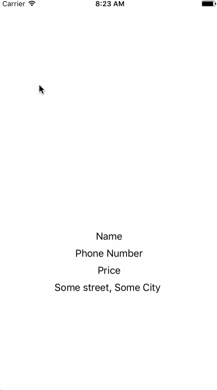

# iDev-Business-Viewer - iDev Workshop 2

A simple iOS Yelp client to teach students how to use an API along with basic OAuth authentication flow and image downloading. Also shows how slow regular downloading of images is 😉

### Gitbook  - Still under development :(

